# ObliTrack

**Contract Lifecycle & Obligation Management for legal and procurement teams.**

## Overview

Every contract a company signs comes with a set of promises baked into its
fine print — a renewal that auto-triggers unless someone objects in time, a
termination window that closes after sixty days, a payment milestone tied
to a date nobody put on a calendar. None of that lives anywhere a computer
can see it. It lives in a PDF, in someone's memory, or in a spreadsheet
that's already a version behind.

ObliTrack is a system I designed and am building to close that gap: it
ingests a signed contract, extracts every obligation, deadline, and
monetary milestone it contains, and turns that into a live, queryable
compliance calendar with proactive alerts — so a missed renewal window
becomes something that gets caught weeks in advance, not something legal
finds out about after the fact.

This repository is the engineering build of that system, developed in
phases, each one shipped as a working, tested increment.

## The Problem

Organizations sign hundreds of contracts a year — vendor agreements,
NDAs, leases, MSAs, licenses. Each one contains obligations buried in
dense, inconsistently formatted legal prose: renewal notice deadlines
("either party may terminate with 60 days' written notice before the
renewal date"), payment triggers, SLA commitments, compliance
requirements. Today, tracking that lives in people's memory, email
threads, or spreadsheets that go stale the moment they're created.

The cost of that gap is concrete: auto-renewals nobody wanted, termination
windows missed that lock a company into another year of unfavorable
terms, payment triggers missed that damage vendor relationships. It's a
data-extraction and monitoring problem wearing a legal-process costume —
which is exactly the kind of problem software is good at, if built
carefully enough to be trusted with legally binding dates.

## Who Has This Problem

- **Legal ops teams and in-house counsel**, who own contract risk but are
  tracking it manually across dozens or hundreds of active agreements.
- **Procurement and vendor managers**, who need to know when a vendor
  contract is coming up for renewal or renegotiation before it's too late
  to act.
- **SMBs without a dedicated legal function**, where contract tracking
  falls to whoever remembers to check — which is precisely how renewal
  windows get missed.

## What I Built

ObliTrack mirrors the real CLM (Contract Lifecycle Management) workflow
used by enterprise tools like Ironclad and ContractPodAi — not a single
clause-classification demo, but the full pipeline:

```
Contract Intake → Clause/Obligation Extraction → Obligation Tracking DB
   → Compliance Calendar → Automated Alerting → Renewal/Renegotiation Workflow
```

**Delivered so far** (Phases 0–4 of the build — see
[Engineering Walkthrough](docs/ENGINEERING_WALKTHROUGH.md) for the full,
step-by-step account):

- **A production-shaped foundation** — FastAPI backend, React frontend,
  Dockerized end to end, CI enforcing lint/type-check/tests/security scans
  on every push, both container images hardened to run as non-root.
- **Multi-tenant auth & RBAC** — JWT access/refresh tokens with rotation
  and a revocation denylist, role-based access control, rate-limited auth
  endpoints, and an audit trail on every state-changing action.
- **A real document ingestion pipeline** — authenticated multipart
  upload with magic-byte file validation (not just trusting the file
  extension), PDF/DOCX parsing into paragraph-level chunks, and a
  deterministic pre-filter that flags obligation-bearing text before
  anything more expensive touches it.
- **Local semantic search** — every candidate paragraph is embedded on
  CPU via a locally-run sentence-transformer model (zero API cost, zero
  rate limit), stored in Postgres via `pgvector`, and matched against a
  fixed reference set per obligation category — the second free filter
  stage in a pipeline explicitly designed to minimize what ever reaches a
  paid LLM call.

**Still ahead**: the LLM-based structured extraction call itself, the
compliance calendar UI, the automated alerting scheduler, and the
renewal-workflow views — see the roadmap in the engineering walkthrough.

## Architecture

```mermaid
flowchart TB
    %% ==========================================
    %% CLIENT & PRESENTATION LAYER
    %% ==========================================
    subgraph CLIENT["<b>Client & Presentation Layer</b>"]
        User(["<b>Legal Ops & Procurement Teams</b><br/>Contract Lifecycle & Risk Stakeholders"])
        FE["<b>React 19 + TypeScript SPA</b><br/>Vite • Tailwind CSS • shadcn/ui<br/><i>Dashboard • Review Queue • Calendar</i>"]
    end

    %% ==========================================
    %% API GATEWAY & SECURITY PERIMETER
    %% ==========================================
    subgraph GATEWAY["<b>API Gateway & Security Perimeter (FastAPI)</b>"]
        API["<b>FastAPI Core Application</b><br/>Async ASGI • Pydantic v2 • OpenAPI"]
        AUTH["<b>Security & Governance Engine</b><br/>• PyJWT Bearer Auth + Rotating Refresh Denylist<br/>• Multi-Tenant Org RBAC (Admin / LegalOps / Viewer)<br/>• SlowAPI Rate Limiting & Immutable Audit Trail"]
    end

    %% ==========================================
    %% ZERO-COST TOKEN-MINIMIZATION FUNNEL
    %% ==========================================
    subgraph FUNNEL["<b>Zero-Cost Token-Minimization Ingestion Funnel</b>"]
        direction TB
        INGEST["<b>1. Validation & Intake</b><br/>Magic-byte verify (%PDF- / DOCX zip)<br/>SHA-256 hash dedup • 20MB limit"]
        PARSER["<b>2. Structural Parser & Chunking</b><br/>PyMuPDF (PDF blocks) & python-docx<br/>Section heading tagging & chunking"]
        PREFILTER["<b>3. Deterministic Pre-Filter</b><br/>Regex dates, durations, currency, keywords<br/>Discard definitions, recitals, notary"]
        EMBED["<b>4. Local Semantic Filter (CPU)</b><br/>BAAI/bge-base-en-v1.5 sentence-transformers<br/>Cosine similarity vs. CUAD anchor exemplars"]
        DEDUP["<b>5. Org Precedent Cache & Dedup</b><br/>pgvector HNSW cosine distance search<br/>Reuse structured results on template match"]
    end

    %% ==========================================
    %% BATCHED STRUCTURED LLM EXTRACTION ENGINE
    %% ==========================================
    subgraph LLM_TIER["<b>Batched Structured Extraction Engine</b>"]
        ROUTER{"<b>Quota-Aware Provider Router</b><br/>Inspects live quota in llm_usage_log<br/>Primary vs. fallback auto-failover"}
        GROQ["<b>Primary: Groq Cloud API</b><br/>openai/gpt-oss-20b (>750 tok/s)<br/>Single batched prompt per contract"]
        GEMINI["<b>Fallback: Google Gemini API</b><br/>gemini-2.5-flash / flash-lite<br/>Automatic 429 quota failover & summary"]
        SCHEMA["<b>Pydantic v2 Schema Enforcer</b><br/>Strict JSON-mode extraction<br/>12 CUAD-derived obligation categories"]
    end

    %% ==========================================
    %% PERSISTENCE & STORAGE LAYER
    %% ==========================================
    subgraph DATA_TIER["<b>Persistence & Vector Storage</b>"]
        DB[("<b>PostgreSQL 16 + pgvector</b><br/>11 Alembic tables • HNSW cosine index<br/>Strict org_id foreign key tenant isolation")]
        STORAGE[["<b>Local Encrypted File Vault</b><br/>UUID-keyed storage outside web root<br/>storage/{org_id}/{contract_id}.ext"]]
    end

    %% ==========================================
    %% COMPLIANCE OPERATIONS & AUTOMATION
    %% ==========================================
    subgraph OPS_TIER["<b>Compliance Operations & Automated Alerting</b>"]
        REVIEW["<b>Human-in-the-Loop Review Queue</b><br/>Confidence score & source paragraph trace<br/>Counsel verification, edits & approvals"]
        CALENDAR["<b>Live Compliance Calendar</b><br/>Proactive renewal & renegotiation timeline"]
        WORKER["<b>Background Automation Worker</b><br/>APScheduler AsyncIOScheduler"]
        ALERT["<b>Proactive Alert Engine</b><br/>Multi-lead alerts: 90 / 60 / 30 / 7 days<br/>Upcoming • At-Risk • Overdue"]
        EMAIL[["<b>SMTP Transactional Email</b><br/>aiosmtplib automated delivery"]]
    end

    %% ==========================================
    %% WORKFLOW RELATIONSHIPS & EDGES
    %% ==========================================
    User -->|"Upload PDF/DOCX & manage deadlines"| FE
    FE <==>|"REST API calls (JWT Bearer Auth)"| API
    API <-->|"Authenticate & enforce RBAC"| AUTH
    API -->|"Stream upload payload"| INGEST
    INGEST -->|"Store validated file"| STORAGE
    INGEST -->|"Raw document stream"| PARSER
    PARSER -->|"Paragraph-level chunks"| PREFILTER
    PREFILTER -->|"Candidate chunks (boilerplate dropped)"| EMBED
    EMBED -->|"768-dim BGE vector embeddings"| DEDUP
    DEDUP <-->|"Cosine distance query (HNSW)"| DB
    DEDUP -->|"Cache miss: filtered candidate batch"| ROUTER
    DEDUP -.->|"Cache hit: reuse precedent extraction"| SCHEMA
    ROUTER -->|"Primary route (high throughput)"| GROQ
    ROUTER -.->|"Failover route on 429 / quota limit"| GEMINI
    GROQ -->|"Structured JSON"| SCHEMA
    GEMINI -.->|"Structured JSON"| SCHEMA
    SCHEMA -->|"Persist contracts & obligations"| DB
    DB -->|"Unreviewed obligations"| REVIEW
    REVIEW -.->|"Counsel approval & adjustments"| FE
    DB -->|"Active milestones & dates"| CALENDAR
    CALENDAR -.->|"Interactive timeline & filters"| FE
    WORKER -->|"Scheduled daily scan"| DB
    WORKER -->|"Trigger due alerts"| ALERT
    ALERT -->|"Deliver notifications"| EMAIL
    EMAIL -.->|"Actionable alerts"| User

    %% ==========================================
    %% CLASS DEFINITIONS & STYLING
    %% ==========================================
    classDef client fill:#0f172a,stroke:#38bdf8,stroke-width:2px,color:#ffffff;
    classDef gateway fill:#1e1b4b,stroke:#818cf8,stroke-width:2px,color:#ffffff;
    classDef funnel fill:#064e3b,stroke:#34d399,stroke-width:2px,color:#ffffff;
    classDef llm fill:#451a03,stroke:#fbbf24,stroke-width:2px,color:#ffffff;
    classDef storage fill:#083344,stroke:#22d3ee,stroke-width:2px,color:#ffffff;
    classDef ops fill:#4c0519,stroke:#fb7185,stroke-width:2px,color:#ffffff;
    classDef review fill:#3b0764,stroke:#c084fc,stroke-width:2px,color:#ffffff;

    class User,FE client;
    class API,AUTH gateway;
    class INGEST,PARSER,PREFILTER,EMBED,DEDUP funnel;
    class ROUTER,GROQ,GEMINI,SCHEMA llm;
    class DB,STORAGE storage;
    class WORKER,ALERT,EMAIL ops;
    class REVIEW,CALENDAR review;
```



Every query is scoped by the authenticated user's organization at the
database level — a user from one organization can never see another's
contracts, obligations, or files, enforced in code and covered by tests,
not left to convention.

### Key Architectural Principles

- **Zero-Cost Funnel:** Ingested documents pass through deterministic regex filtering, local CPU embeddings (`bge-base-en-v1.5`), and `pgvector` deduplication before triggering any paid or rate-limited LLM API calls.
- **Strict Multi-Tenant Isolation:** Every relational query and vector similarity lookup is strictly filtered by the authenticated user's `organization_id` at the database level.
- **Quota-Aware Failover:** Dual LLM providers (Groq primary, Gemini fallback) with automated quota tracking and Pydantic v2 validation guarantee deterministic structured extractions.


## Results & Engineering Rigor

Numbers that are true today, not projections:

| | |
|---|---|
| **Automated tests** | 76, all passing, run against a real Postgres+pgvector instance in CI |
| **Type coverage** | `mypy --strict` clean across the entire backend (app, scripts, and tests) |
| **Dependency security** | Zero known vulnerabilities (`pip-audit` + `npm audit`), including the ML dependency tree |
| **Database schema** | 11 tables, fully migration-managed via Alembic, zero schema drift between models and migrations |
| **Container security** | Both Docker images verified running as non-root |
| **CI coverage** | Lint, type-check, tests, migration-drift check, dependency audit, and a Docker build smoke test — on every push |

The token-minimization design (regex pre-filter, then local semantic
similarity, then clause-level dedup — all before any paid LLM call) is
built and tested end-to-end through the embedding stage; its actual
token-reduction ratio will be measured and published once the LLM
extraction step (Phase 5) is live.

## How to Run It

### Prerequisites

Python 3.13, Node 22+ (vitest 5 requires it), Docker (for Postgres+pgvector,
or run it directly).

### Backend

```bash
cd backend
python -m venv .venv
./.venv/Scripts/pip install -r requirements.txt -r requirements-dev.txt   # Windows
# source .venv/bin/activate && pip install -r requirements.txt -r requirements-dev.txt  # macOS/Linux

./.venv/Scripts/python -m uvicorn app.main:app --reload   # http://localhost:8000
./.venv/Scripts/python -m pytest                          # 76 tests
./.venv/Scripts/python -m ruff check .                     # lint
./.venv/Scripts/python -m mypy app scripts tests            # type-check
```

`requirements.txt` / `requirements-dev.txt` are fully pinned (`pip freeze`
output) for reproducible installs.

With a Postgres+pgvector instance running (see Docker Compose below, or
`docker run -d -e POSTGRES_USER=oblitrack -e POSTGRES_PASSWORD=oblitrack
-e POSTGRES_DB=oblitrack -p 5432:5432 pgvector/pgvector:pg16`):

```bash
./.venv/Scripts/python -m alembic upgrade head          # apply migrations
./.venv/Scripts/python -m scripts.seed_demo_data --demo   # optional: realistic demo data from CUAD
```

The first request that needs the embedding model (Phase 4) downloads and
caches `BAAI/bge-base-en-v1.5` (~440MB) from Hugging Face — a one-time
cost per machine. On a constrained or proxied network, prefix commands
with `HF_HUB_DISABLE_XET=1` to force a plain HTTP download instead of
Hugging Face's newer chunked-transfer backend.

### Frontend

```bash
cd frontend
npm install
npm run dev         # http://localhost:5173
npm run test          # vitest
npm run lint           # oxlint
npm run typecheck     # tsc --noEmit
npm run build          # production build
```

### Everything, via Docker Compose

```bash
cp .env.example .env   # fill in real secrets
cd infra
docker compose up --build
```

Starts Postgres (with `pgvector`), the API, the background worker, and the
frontend — wired together via `infra/docker-compose.yml`.

## Repository Layout

```
backend/    FastAPI app — Python 3.13, async SQLAlchemy + Alembic
frontend/   React 18 + Vite + TypeScript + Tailwind + shadcn/ui
infra/      docker-compose.yml (postgres+pgvector, api, worker, frontend)
data/       git-ignored reference datasets (see data/README.md)
docs/       engineering documentation
```

## Configuration

All configuration is environment-variable driven — see
[`.env.example`](.env.example) for the full list. Never commit `.env`.

## License

All rights reserved. See [`LICENSE`](LICENSE).
